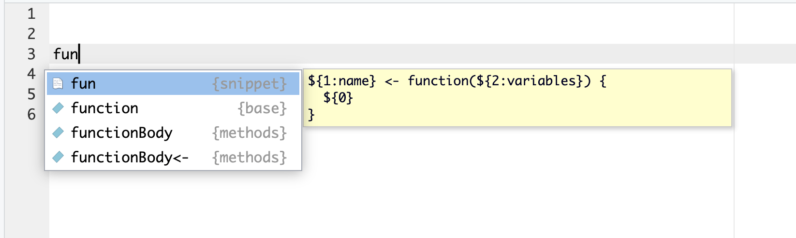

# SimCRC README

<!-- 
&#10;**Here are some ideas to get you started:**
🙋‍♀️ A short introduction - what is your organization all about?
🌈 Contribution guidelines - how can the community get involved?
👩‍💻 Useful resources - where can the community find your docs? Is there anything else the community should know?
🍿 Fun facts - what does your team eat for breakfast?
🧙 Remember, you can do mighty things with the power of 
[Markdown](https://docs.github.com/github/writing-on-github/getting-started-with-writing-and-formatting-on-github/basic-writing-and-formatting-syntax) 
-->
<!-- 
To render the quarto document as an .md file you need to execute the following command in the *terminal*:
- quarto render profile/README.qmd 
-->

# Additional coding resources

## Multithreading with `data.table`

Enable Multithread with data.table in Mac/Intel chips offers faster and
more efficient data processing, allowing for quicker analysis of complex
datasets. Multithreading refers to the ability of a CPU to execute
multiple threads, which can speed up computational tasks. `data.table`
can leverage this capability to perform data operations in parallel,
making full use of the CPU’s multiple cores.

[Go to the tutorial](multithread/multithread.pdf)

## Code snippets

The team generated handy code snippets in R to generate script headers,
ggplot templates, among others. These snippets can be found in the
[`code_snippets.txt`](https://github.com/SimCRC/.github/blob/main/code_snippets.txt)
file. It is important to note that these snippets can be updated and
extended in future versions of the code.

### What are snippets?

Snippets are pieces of re-usable boilerplate code. They are very useful
to avoid the repetition of writing several lines of code since they are
a way to automate the insertion of pre-made pieces of code.

### How to use snippets?

To insert a snippet you have to write it, press `Tab`, and then select
it from a completion list.

It will be inserted along with some text placeholders which you can fill
in. To move to the next placeholder you have to press `Tab`.

### How to add new snippets?

To create or customize snippets, in RStudio you have to access
`Global Options/Code/Editing` and click into *Edit Snippets*. In that
window you will see the list of all the snippets present in your
computer.

To add the list of [predefined
snippets](https://github.com/SimCRC/.github/blob/main/code_snippets.txt)
you just have to copy them and paste them by adding new lines in *Edit
Snippets.*

To create your own custom snippets, or to edit the existing ones please
read the [RStudio
Snippets](https://rstudio.github.io/rstudio-extensions/rstudio_snippets.html)
website. This
[website](https://www.hertiecodingclub.com/events/07_shorcuts_r/) can
also be of help if you are looking for additional shortcuts or
capabilities included in RStudio.
